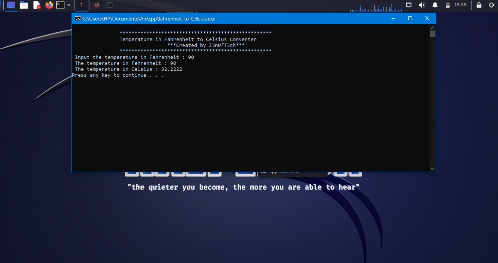
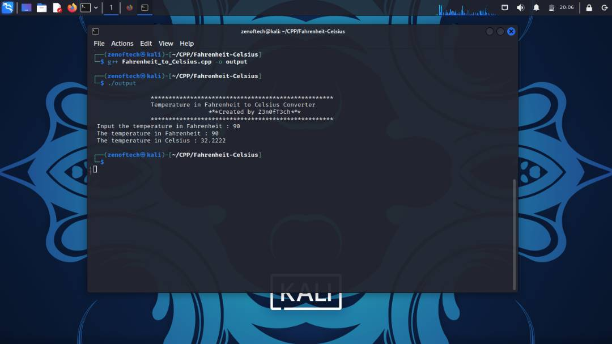

# Temperature in Fahrenheit to Celsius Converter.

### This program is a console program, it ask the user for an input in `fahrenheit` and it convert it to `celsius`.

## Tool used and tested on.
1. `Microsoft Visual Studio enterprise.` _(in windows)_
2. `vim` _(in Linux)_ and using **g++** for compilation.

> *Usage*

> **Note** For normal user who is not a developer, click  <a href="./fahrenheit_to_celsius.exe">here</a> to download the executable file and run it in your pc.

- Output after running the executable file.

<p align="center">
</p>

---
### For Developers.
- Clone this repository using this;

```
git clone https://github.com/zenoftech/CPP.git
```
- Then `cd CPP` and edit the **fahrenheit_to_celsius.cpp* file to suit your want and run it.

> **Note** Linux users, you have to compile the file using;

```
g++ fahrenheit_to_celsius.cpp
```

## view
> **Note** I want the name of the compile file to be `output` that is why I use the argument `-o output` after the file name.

<p align="center">
</p>

